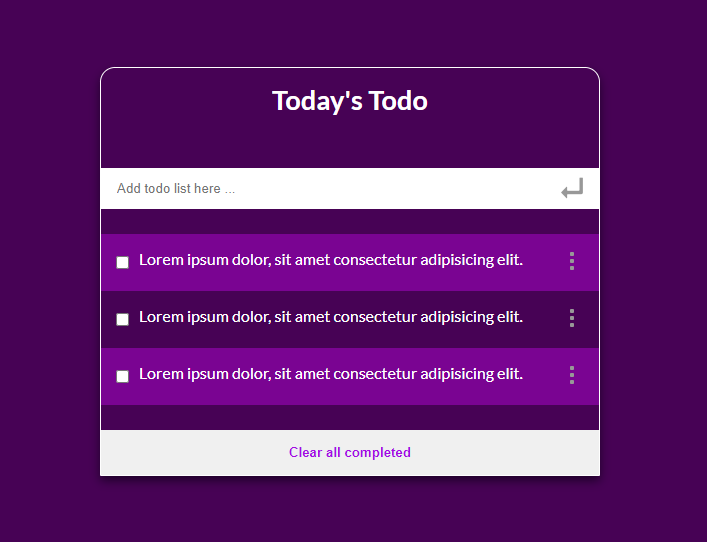

<a name="readme-top"></a>

<div align="center">

  
  <br/>

  <h3><b>Microverse README Template</b></h3>

</div>


# 📗 Table of Contents

- [📗 Table of Contents](#-table-of-contents)
- [📖 Todo LIst ](#-todo-list-)
  - [🛠 Built With ](#-built-with-)
    - [Tech Stack ](#tech-stack-)
    - [Key Features ](#key-features-)
  - [🚀 Live Demo ](#-live-demo-)
  - [💻 Getting Started ](#-getting-started-)
    - [Prerequisites](#prerequisites)
    - [Setup](#setup)
    - [Install](#install)
    - [Usage](#usage)
  - [👥 Author ](#-author-)
  - [🔭 Future Features ](#-future-features-)
  - [🤝 Contributing ](#-contributing-)
  - [⭐️ Show your support ](#️-show-your-support-)
  - [🙏 Acknowledgments ](#-acknowledgments-)
  - [📝 License ](#-license-)


# 📖 Todo LIst <a name="about-project"></a>

> This is A simple but effective and responsive (mobile first) Microverse exercize project.
>
> **o-do list** is a tool that helps to organize your day. It simply lists the things that you need to do and allows you to mark them as complete.

## 🛠 Built With <a name="built-with"></a>

### Tech Stack <a name="tech-stack"></a>

> I am using Html, Css and Javascript es6 Front end development.

<details>
  <summary>Client</summary>
  <ul>
    <li>HTML</li>
    <li>CSS</li>
    <li>JAVASCRIPT</li>
  </ul>
</details>

<!-- Features -->

### Key Features <a name="key-features"></a>

> Some key feature of this project

- **User can add Book by adding book title and book author]**
- **User can Remove Book from book list**

<p align="right">(<a href="#readme-top">back to top</a>)</p>

<!-- LIVE DEMO -->

## 🚀 Live Demo <a name="live-demo"></a>

> ## Our project demo picture
> 
  <br/>

- [Live Demo Link](https://raihan2bd.github.io/Todo-List/)

<p align="right">(<a href="#readme-top">back to top</a>)</p>

<!-- GETTING STARTED -->

## 💻 Getting Started <a name="getting-started"></a>

>Please follow the instructions to clone my repo
To get a local copy, follow these simple example steps.
Clone this repository or download the Zip folder:

### Prerequisites

>Inorder to check the linters errors make sure you have installed the [nodejs](https://nodejs.org)


### Setup

>Clone this repository to your desired folder: cd [folder] to navigate and run the below comand to clone the project

```sh
git clone https://github.com/raihan2bd/Todo-List.git
```


### Install

Install this project with:

download npm the packages
```sh
npm install --save-dev
```

### Usage

 > To see the project in your local browser first of all, go to the dist folder then open the index.html file.


<p align="right">(<a href="#readme-top">back to top</a>)</p>


## 👥 Author <a name="authors"></a>


👤 **Abu Raihan**

- GitHub: [@githubhandle](https://github.com/githubhandle)
- Twitter: [@twitterhandle](https://twitter.com/twitterhandle)
- LinkedIn: [LinkedIn](https://linkedin.com/in/raihan2bd)

<p align="right">(<a href="#readme-top">back to top</a>)</p>

<!-- FUTURE FEATURES -->

## 🔭 Future Features <a name="future-features"></a>


- [ ] **I will add styles and also make this project nice and user fiendly**
- [ ] **I will add more functionality using javascript such as drag and drop.**

<p align="right">(<a href="#readme-top">back to top</a>)</p>

<!-- CONTRIBUTING -->

## 🤝 Contributing <a name="contributing"></a>

Contributions, issues, and feature requests are welcome!

Feel free to check the [issues page](../../issues/).

<p align="right">(<a href="#readme-top">back to top</a>)</p>

<!-- SUPPORT -->

## ⭐️ Show your support <a name="support"></a>

> Give a ⭐️ if you like this project!


<p align="right">(<a href="#readme-top">back to top</a>)</p>

<!-- ACKNOWLEDGEMENTS -->

## 🙏 Acknowledgments <a name="acknowledgements"></a>

> Without Microverse Help this project not compleated at all so thanks a lot Microverse for giving us this kind of opertunity.


<p align="right">(<a href="#readme-top">back to top</a>)</p>


<!-- LICENSE -->

## 📝 License <a name="license"></a>

This project is [MIT](./LICENSE) licensed.

<p align="right">(<a href="#readme-top">back to top</a>)</p>
